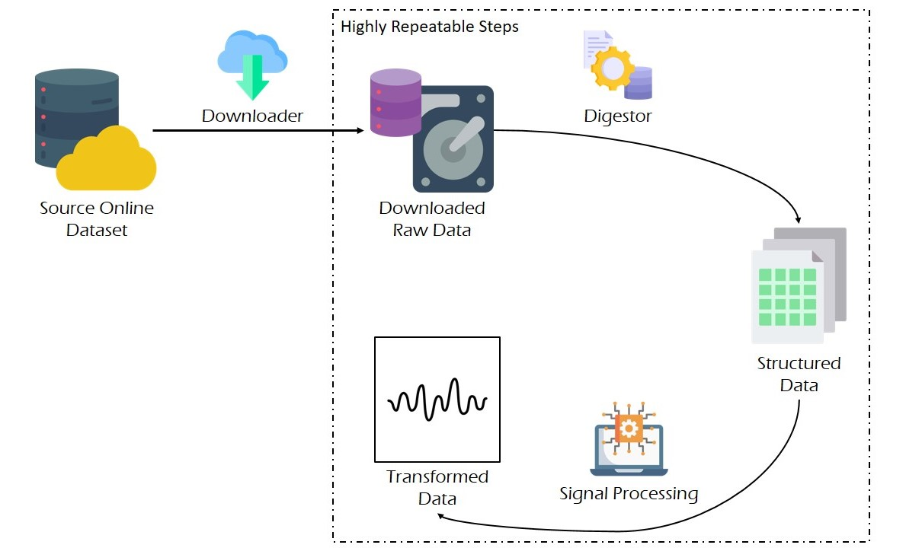
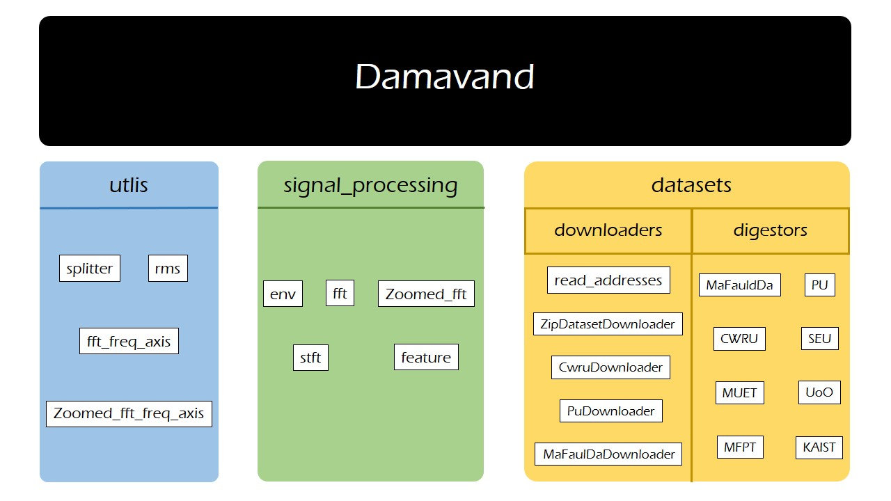

# Damavand

<p align="center">
  
</p>

## Introduction

Damavand is a package to simplify rotary machines vibration-based analysis, through standardizing downloading, loading and transforming processes. The main motivation behind developing it is to democratize rotary machine intelligent predictive maintenance, through the development of an end-to-end unified data processing framework, covering from downloading the raw data to data preprocessing.

## Terminology and Lifecycle

Damavand simplifies the development of an Extract-Transform-Load (ETL) pipeline for a rich collection of benchmark rotary machines dataset; followings are the essential steps of such pipelines:

1. **Downloading the dataset**: datasets are downloadable using either custom or general *downloaders*.
2. **Mining the dataset**: *digestors* transform raw dataset files into structured pairs of signals and metadata (**mining** for short).
3. **Application of signal processing**: *signal processing tehcniques* are employed to process and enrich the signal banks, for the downstream analysis.

The image below, illustrates the lifecycle of a Damavand pipeline. As highlighted in the image, employment of Damavand makes the development of ETL pipelines highly repeatable, resulting in faster iterative trials.



It is worth mentioning that we do not regard data augmentation as an essential step of the pipeline; therefore, we have not included that in this section; complementary explanations on data augmentation using Damavand is provided late on this page.

## Anatomy

Damavand currently consists of four modules:

- **utils**: a submodule to include genral and basic functions
- **signal_processing**: implementation of the most frequently-used signal processing transforms and features used for vibration analysis
- **datasets**: this submodule consists of two parts:
    * **downloaders**: helping classes to download benchmark datasets
    * **digestors**: helping classes to process raw dataset files into structured pairs of signal banks and their corresponding metadata
- **augmentations**: implementation of a collection of data augmentation techniques, suiting vibration data

The image below, illustrates an overview of the Damavand.



## Datasets

Available datasets are listed in the table below:

|  Dataset |     $F_s$ (kHz)    |           Rotational Speed          |                                     Multiple Loads (Loading pattern)                                    |                                 Classes                                |                                                Available Channels                                                | Source                                                                                                                     |
|:--------:|:------------------:|:-----------------------------------:|:-------------------------------------------------------------------------------------------------------:|:----------------------------------------------------------------------:|:----------------------------------------------------------------------------------------------------------------:|----------------------------------------------------------------------------------------------------------------------------|
|   MFPT   | 97.656  and 48.828 |                25 Hz                |                                            Yes (Running load)                                           |                             Normal BIR BOR                             |                                                  1 Accelerometer                                                 | https://www.mfpt.org/fault-data-sets/                                                                                      |
|   KAIST  |        25.6        |         680 RPM to 2460 RPM         |                                Yes (running torque: 0 Nm, 2 Nm and 4 Nm)                                |                           Normal BIR BOR M U                           |                        4 Accelerometers (vertical and horizontal per each bearing housing)                       | https://data.mendeley.com/datasets/ztmf3m7h5x/6                                                                            |
|   CWRU   |      12 and 48     | 1730 RPM 1750 RPM 1772 RPM 1790 RPM |                                     Yes (rotational speed variation)                                    |                           Normal BIR BOR BBP                           |                     2 Accelerometers (one for drive-end bearing and one for the fan-end one)                     | https://engineering.case.edu/bearingdatacenter                                                                             |
|    SEU   |          2         |             20 Hz 30 Hz             |                                     Yes (rotational speed variation)                                    |                         Normal BIR BOR BIO BBP                         |                                                 8 Accelerometers                                                 | https://ieeexplore.ieee.org/abstract/document/8432110 https://github.com/cathysiyu/Mechanical-datasets/tree/master/gearbox |
| MaFaulda |        51.2        |        Variable (tachometer)        |                                     Yes (rotational speed variation)                                    | Normal M (vertical/horizontal) U UHB (OR, CP \& BP) OHB (OR, CP \& BP) | 1 tachometer Triaxial acceleration from underhang bearing Triaxial acceleration from overhang bearing Microphone | https://www02.smt.ufrj.br/~offshore/mfs/page_01.html                                                                       |
|   MEUT   |         10         |               Variable              |                                Yes (running power: 100, 200 & 300 Watts)                                |                 Normal (with & without pulley) BIR BOR                 |                                               Triaxial acceleration                                              | https://data.mendeley.com/datasets/fm6xzxnf36/2                                                                            |
|    UoO   |         200        |               Variable              | Yes (variation of rotational speed: increasing, decreasing increasing-decreasing decreasing-increasing) |                             Normal BIR BOR                             |                              1 Accelerometer 1 Encoder (measuring rotational speed)                              | https://data.mendeley.com/datasets/v43hmbwxpm/1                                                                            |
|    PU    |         64         |               Variable              |                             Yes (rotational speed load torque radial force )                            |  Normal Bearing inner race Bearing outer race Bearing inner/outer race |                           1 Accelerometer 2 Current sensors (measuring phase currents)                           | https://mb.uni-paderborn.de/kat/forschung/kat-datacenter/bearing-datacenter/data-sets-and-download                         |

In the above table, $F_s$, BIR, BOR, M, U, BBP, BIO, UHB, OHB and BCP correspond to the sampling frequency, bearing inner race fault, bearing outer race fault, misalignment, unbalance, bearing ball problem, combinatory inner and outer races fault, underhang bearing, overhang bearing and bearing cage problem.

## Installation

Currently, Damavand is accessible through the official Github repository, as below:

```bash
git clone https://github.com/amirberenji1995/damavand
```

Once the repository is cloned, install the dependencies as below:

```bash
pip install -r damavand/requirements.txt
```

## Quickstart

Once the package is installed, its whole functionality is accessible; the code snippet below, demonstrate a simple usage scenario, where a dataset is downloaded, loaded and processed.

```Python
# Importings
from damavand.damavand.datasets.downloaders import read_addresses, ZipDatasetDownloader
from damavand.damavand.datasets.digestors import UoO
import pandas as pd

# Downloading the dataset
addresses = read_addresses() # reading the addresses
downloader = ZipDatasetDownloader(addresses['UoO']) # instantiating the downloader to download the UoO dataset (https://data.mendeley.com/datasets/v43hmbwxpm/1)
downloader.download_extract('UoO.zip', 'UoO/')  # downloading and extracting the dataset

# Mining the dataset
dataset = UoO('UoO/', ['Channel_1', 'Channel_2'], [1]) # instantiating the dataset
mining_params = {'win_len': 10000, 'hop_len': 10000} # defining the mining parameters
dataset.mine(mining_params) # mining the dataset

# Aggregating the mined data over the first channel
df = pd.concat(dataset.data['Channel_1']).reset_index(drop = True)

# Signal/Metadata split
signals, metadata = df.iloc[:, : -3], df.iloc[:, -3 :] # last three columns are state, loading and repetition; therefore, they are excluded into metadata
```

## Documentation

Detailed API reference of each module is accessible through the links, below:
- [**utils**](documentations/utils.md)
- [**signal_processing**](documentations/signal_processing.md)
- [**datasets**](documentations/datasets.md)
- [**augmentations**](documentations/augmentations.md)

## Demonstrations and Tutorials

For each dataset available in this package, a detailed demonstration is provided that includes downloading, mining and time-domain visualization. These demonstrations can be found [here](https://github.com/amirberenji1995/damavand/tree/main/dataset_demonstrations).

Additionally, following tutorials are provided:

1. [Signal Processing 101]()
2. [How to develop a digestor for a custom dataset?]()
3. [How to develop a custom feature to extract?]()
4. [Anomaly detection]()
5. [Health state classification]()

## License


## Next steps

We highly encourage our developers to help in extending the Damavand, particularly in the following directions:

1. Adding new datasets
2. Adding new signal processing methods


## Cite

