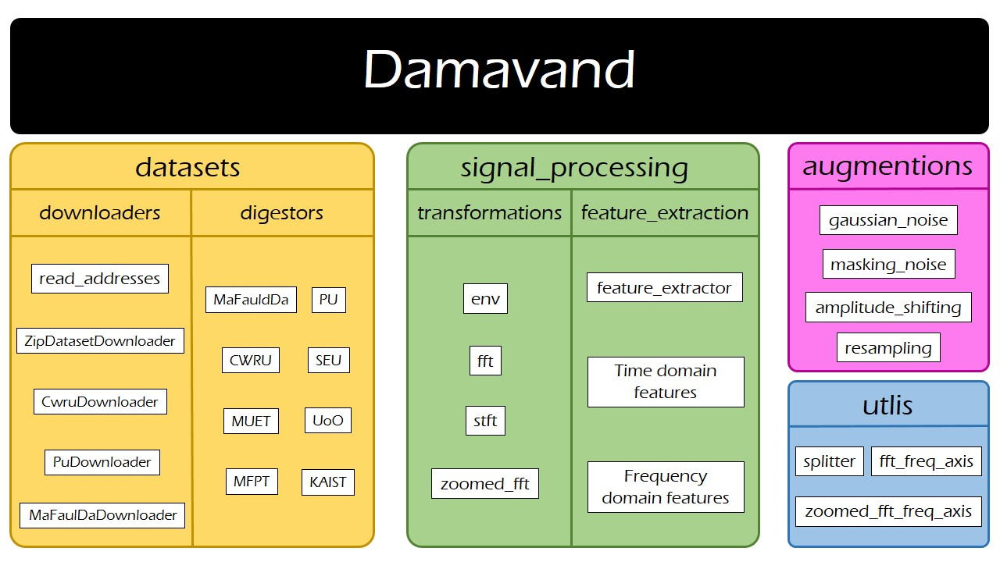

# Damavand

Damavand is a library to simplify rotary machines vibration-based analysis, through standardizing downloading, loading and transforming processes. The main motivation behind developing it is to democratize rotary machine intelligent predictive maintenance, through the development of an end-to-end unified data processing framework, covering from downloading the raw data to data preprocessing.

Damavand currently consists of three modules:

- utils: a submodule to include genral and basic functions
- signal_processing: implementation of the most frequently-used signal processing operations and transforms used for vibration analysis
- datasets: this submodule consists of two parts:
    * downloaders: helping classes to download benchmark datasets
    * digestors: helping classes to process raw dataset files into structured pairs of signal banks and their corresponding metadata

The image below, 

Documentation on each module:
- [signal_processing](documentation/signal_processing.md)
- [datasets](documentation/datasets.md)